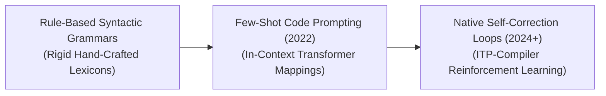

# Awesome-Autoformalization
## Autoformalization in AI: Evolution, Variants, Types, & Applications

Autoformalization is an advanced reasoning and natural language processing paradigm in artificial intelligence that translates informal, natural language statements (such as conversational mathematics, physics problems, or software feature descriptions) into formal, machine-verifiable mathematical expressions or source code specifications. Unlike standard text summarization or machine translation, autoformalization must bridge the gap between ambiguous, context-dependent human language and mathematically rigorous, deterministic code blocks. This technique allows AI systems to interface directly with interactive theorem provers (ITPs) like Lean, Isabelle, or Coq, enabling automated proof checking and transforming AI from a statistical mimic into a provably correct reasoning agent.

---

## 1. The Chronological Evolution

The technical approach to autoformalization has transitioned from hand-crafted syntactic parsers to prompt-engineered few-shot code mappings, moving toward modern reinforcement-learned loop systems backed by automated theorem verifiers.

| Era / Phase | Concept & Details / Limitations | Year First Used | First Paper Link |
| :--- | :--- | :--- | :--- |
| **The Rule-Based Syntactic Era (Classic Symbolic AI)** | **Concept:** Early frameworks relied on hand-crafted grammars, lambda calculus mappings, and rigid semantic lexicons to parse highly specific natural language structures into logical statements. **Limitation:** Highly fragile and unscalable. The system collapsed if a user introduced conversational text variance, slang, or a minor grammatical typo. | 2004 | [Zinn (2004)](https://pub.uni-bielefeld.de/record/2301344) |
| **The In-Context Few-Shot LLM Era (Wu et al., 2022)** | **Concept:** Spurred by the emergence of high-capacity transformers. Wu et al. demonstrated that Large Language Models could execute autoformalization without explicit architectural adjustments. By providing a few input-output examples in a prompt (e.g., an informal math problem paired with its matching Isabelle/HOL statement), the model generalizes to parse unseen problems via in-context learning. **Limitation:** Suffered from subtle logical hallucinations, where the model outputs syntax that *looks* mathematically sound but fails to compile or verify in an interactive theorem prover. | 2022 | [Wu et al. (2022)](https://arxiv.org/abs/2205.12615) |
| **The Self-Correcting & Reinforcement Learned Era (~2024–Present)** | **Concept:** The modern state-of-the-art framework seen in frontier reasoning models. It integrates language networks directly into a closed feedback loop with Interactive Theorem Provers (like Lean 4). The model generates a formal draft, the ITP compiler parses it and returns precise error stack traces, and the model uses System 2 reasoning chains to self-correct its syntax recursively until the formal proof or statement passes compile verification. | 2022 | [Jiang et al. (2022)](https://arxiv.org/abs/2210.12283) |

---

## 2. Core Functional & Target Language Variants

Autoformalization frameworks are strictly categorized based on the underlying formal verification ecosystem they translate into.

| Variant | Mechanism & Target Languages | Year First Used | First Paper Link |
| :--- | :--- | :--- | :--- |
| **Theorem Prover Autoformalization (Math Domain)** | **Mechanism:** Translates informal natural language proofs or mathematical identities into specialized, high-level dependently typed languages. **Target Languages:** **Lean 4**, **Isabelle/HOL**, **Coq**, and **Mizar**. **Significance:** Unlocks the ability for AI to collaboratively solve advanced, unsolved mathematical theorems alongside human researchers by providing provably correct symbolic logic steps. | 2022 | [Wu et al. (2022)](https://arxiv.org/abs/2205.12615) |
| **Formal Specification Autoformalization (Software/Hardware Engineering)** | **Mechanism:** Converts descriptive, human-written software requirements or chip hardware architectures into mathematically rigorous system specifications to guarantee safety limits before physical production. **Target Languages:** **TLA+**, **Verilog/VHDL assertions**, and **Z notation**. | 2023 | [Cosler et al. (2023)](https://arxiv.org/abs/2303.04018) |
| **Executable Abstract Syntax Tree (AST) Mapping** | **Mechanism:** A lightweight variant that transforms conversational multi-step constraints straight into highly structured code logic trees or advanced database macros. **Target Languages:** Formatted JSON schemas, SQL queries, and pure abstract syntax trees. | 2017 | [Rabinovich et al. (2017)](https://arxiv.org/abs/1704.07535) |

---

## 3. Training Paradigms & Data Bottleneck Types

Because high-quality, parallel datasets matching informal human language to exact formal verification code are extremely scarce, AI pipelines deploy distinct data curation types.

| Paradigm | Data Profile | Year First Used | First Paper Link |
| :--- | :--- | :--- | :--- |
| **Few-Shot In-Context Learning (ICL)** | **Data Profile:** Relies on a tiny pool of highly pristine, expert-vetted parallel pairs (typically fewer than 10 examples) injected straight into the prompt context window to steer the base transformer's output formatting. | 2020 | [Brown et al. (2020)](https://arxiv.org/abs/2005.14165) |
| **Synthetic Informal-to-Formal Back-Translation** | **Data Profile:** Solves the data scarcity wall by running the process in reverse (**Informalization**). It takes thousands of lines of open-source formal code (e.g., Lean Mathlib) and uses an LLM to generate easy-to-read, conversational human explanations for them, automatically creating an immense, clean parallel training dataset. | 2023 | [Azerbayev et al. (2023)](https://arxiv.org/abs/2310.10631) |
| **STaR-Style Verification Loops (Self-Taught Reasoner for Formalization)** | **Data Profile:** Ingests vast quantities of unannotated informal mathematical text. The model continuously attempts to formalize and prove the problems, keeping and fine-tuning on the successful formalizations that satisfy the automated ITP compiler, while discarding failures. | 2022 | [Zelikman et al. (2022)](https://arxiv.org/abs/2203.14465) |

---

## 4. Production Engineering Challenges & Mitigations

Deploying autoformalization pipelines across industrial automated reasoning systems introduces intense type-checking alignment boundaries and compiler latency penalties.

| Challenge | The Problem & Mitigation | Year First Used | First Paper Link |
| :--- | :--- | :--- | :--- |
| **The Syntactic Hallucination and Compilation Barrier** | **The Problem:** Deep language models operate on statistical probability; they often generate code that matches the *stylistic appearance* of a formal proof, but contains illegal type-casting hops, non-existent library function calls, or logical contradictions that crash the verification compiler. **Mitigation:** Implementing **Compiler-in-the-Loop Decoding**. The inference framework sets up a sandboxed environment where the model's generated tokens are continuously type-checked by an active ITP server backend, forcing the model to backtrack or self-correct its hidden reasoning chain immediately if a compiler error occurs. | 2023 | [First et al. (2023)](https://arxiv.org/abs/2310.13848) |
| **The Infinite Search State Space Problem** | **The Problem:** Translating a single informal mathematical concept can yield dozens of different formal definitions depending on how libraries are structured, causing the model's token exploration tree to explode in length and saturate inference budgets. **Mitigation:** Pairing the model with **Monte Carlo Tree Search (MCTS)** or dense **Process-Supervised Reward Models (PRMs)** to score the mathematical viability of each intermediate token branch early, pruning away uncompilable syntax paths rapidly. | 2022 | [Lample et al. (2022)](https://arxiv.org/abs/2205.11491) |

---

## 5. Frontier Real-World AI Applications

| Application Area | Real-World Application Details | Year First Used | First Paper Link |
| :--- | :--- | :--- | :--- |
| **Automated Mathematics Discovery & Theorem Proving (Lean 4 Ecosystems)** | **Application:** Deployed within academic research environments. Autoformalization engines ingest complex, natural language mathematical papers, convert their underlying core theories into provable Lean 4 code strings, and execute automated solvers to discover hidden logical flaws or generate verifiable proofs for long-standing math conjectures. | 2024 | [Trinh et al. (2024)](https://www.nature.com/articles/s41586-023-06747-5) |
| **Mission-Critical Aerospace & Hardware Verification** | **Application:** Hardens the safety boundaries of autonomous flight systems, automotive control chips, and medical hardware. Autoformalization engines read human-written operational safety requirements and translate them into mathematical **TLA+ specifications**, letting compilers simulate millions of edge-case scenarios to guarantee the code can never lock up or enter bricked states. | 2023 | [Cosler et al. (2023)](https://arxiv.org/abs/2303.04018) |
| **Enterprise Natural-Language-to-SQL API Engines** | **Application:** Powers intelligent database querying arrays for enterprise software suites. Non-technical corporate managers type abstract data requests (e.g., `"Show me a comparison of Q3 revenue across all departments that beat their targets by 5%"`), and the autoformalization layer converts the intent into a structurally optimized, bulletproof SQL block instantly. | 2018 | [Yu et al. (2018)](https://arxiv.org/abs/1809.08887) |

