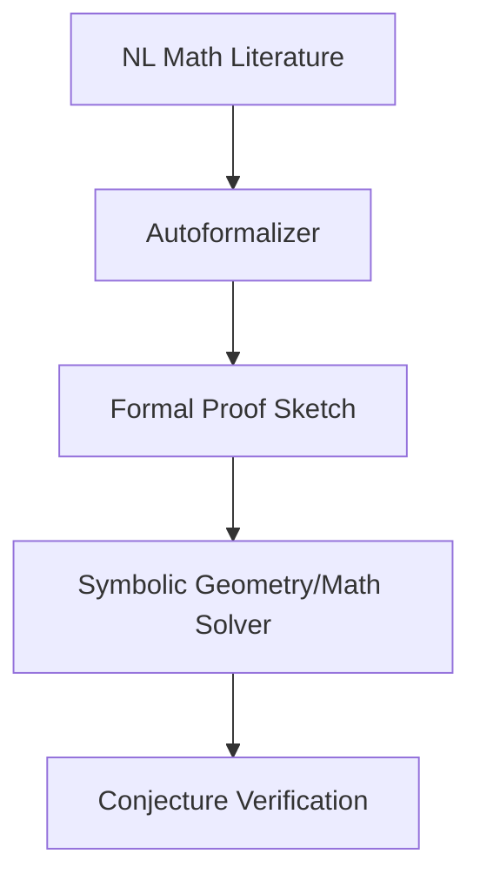

# Automated Mathematics Discovery & Theorem Proving

## Detailed Information
AI engines parse mathematical literature to formalize equations and proofs. Provers such as AlphaGeometry translate tasks to formal representations and run solvers to verify conjectures or uncover novel insights.

## Diagram

## Navigation
[← Back to Main README](../README.md)
