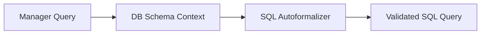

# Enterprise Natural-Language-to-SQL API Engines

## Detailed Information
Converts plain text business queries into executable database queries (SQL). Using semantic parsing and context schemas, the interface translates complex business logic into verified, optimized queries.

## Diagram

## Navigation
[← Back to Main README](../README.md)
