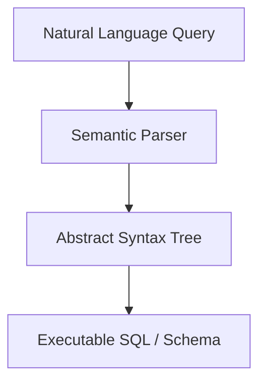

# Executable Abstract Syntax Tree (AST) Mapping

## Detailed Information
A lightweight autoformalization approach mapping natural language to structured abstract syntax trees, JSON schemas, database queries (SQL), or executable formats. By mapping directly to ASTs, semantic parsing can decouple language nuances from compiler syntax constraints.

## Diagram

## Navigation
[← Back to Main README](../README.md)
