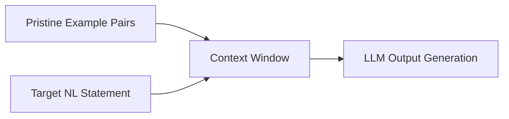

# Few-Shot In-Context Learning (ICL)

## Detailed Information
A prompting paradigm where a model is given a small set of high-quality examples showing the translation of natural language to formal representations. ICL allows base models to format outputs properly without parameter updates, serving as the first step in bootstrapping autoformalization pipelines.

## Diagram

## Navigation
[← Back to Main README](../README.md)
