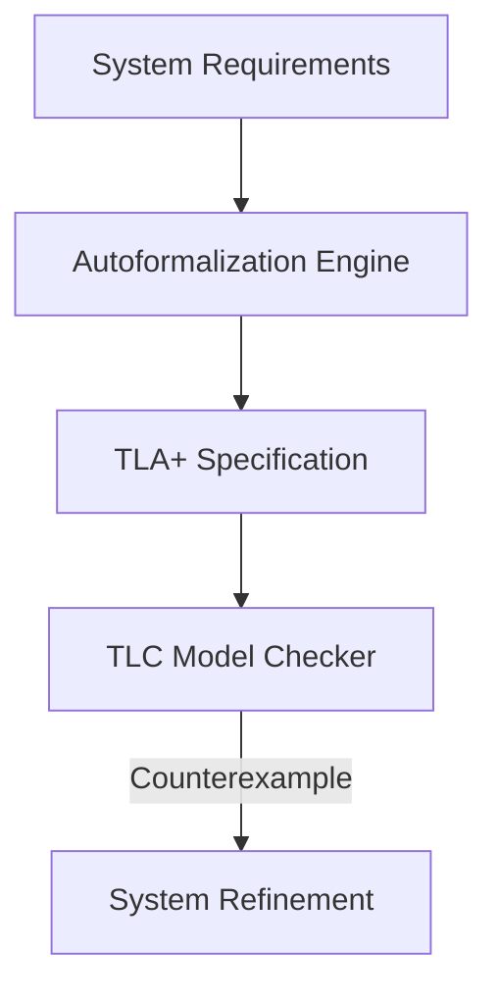

# Formal Specification Autoformalization

## Detailed Information
Translates high-level system requirements, hardware designs, or protocols into mathematically rigorous formal specification languages. By outputting languages like TLA+, Z notation, or Verilog assertions, systems can be checked for correctness, safety, and liveness properties before physical deployment.

## Diagram

## Navigation
[← Back to Main README](../README.md)
