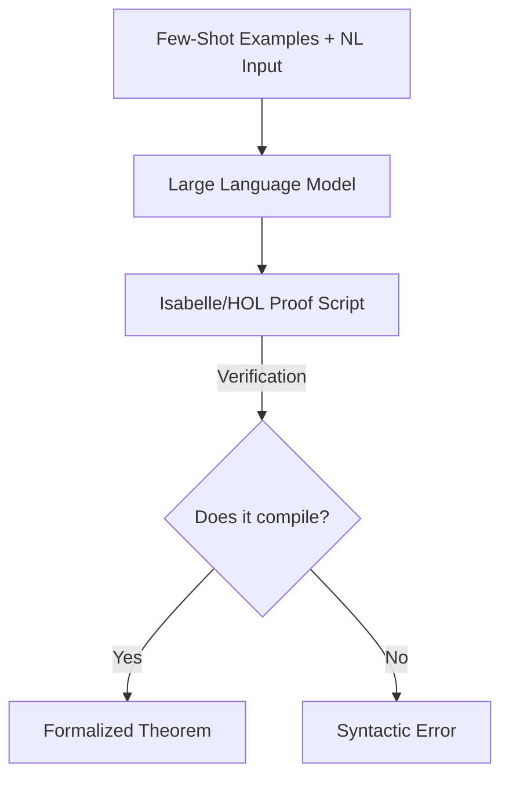

# The In-Context Few-Shot LLM Era

## Detailed Information
The introduction of Large Language Models (LLMs) changed the autoformalization landscape. In-context learning allowed LLMs to map informal mathematics or specifications directly to formal proof scripts (e.g., Isabelle/HOL) using only a few exemplars. However, this era struggled with syntactic and semantic hallucinations, where the generated code appeared valid but failed type-checking.

## Diagram

## Navigation
[← Back to Main README](../README.md)
