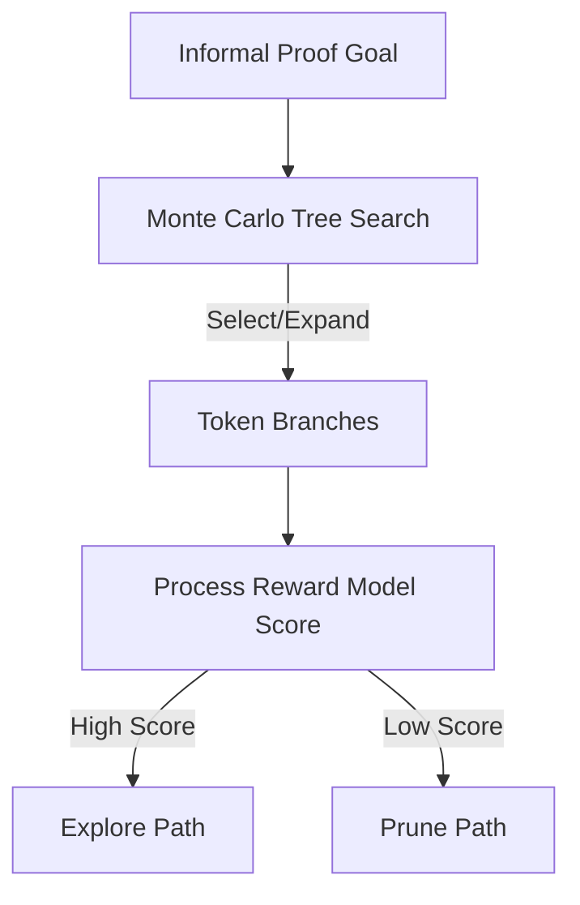

# The Infinite Search State Space Problem

## Detailed Information
The mathematical proof search tree is incredibly large, and autoformalizing a statement can lead to multiple alternative definitions. Using Monte Carlo Tree Search (MCTS) or Process-Supervised Reward Models (PRMs) helps steer search steps toward valid verification branches.

## Diagram

## Navigation
[← Back to Main README](../README.md)
