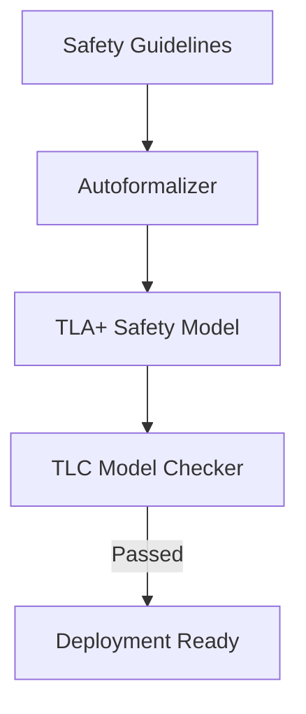

# Mission-Critical Aerospace & Hardware Verification

## Detailed Information
Autoformalization translates natural-language system requirements directly into formal languages like TLA+ or assertion languages. This allows software checking of critical control systems before manufacturing or deployment.

## Diagram

## Navigation
[← Back to Main README](../README.md)
