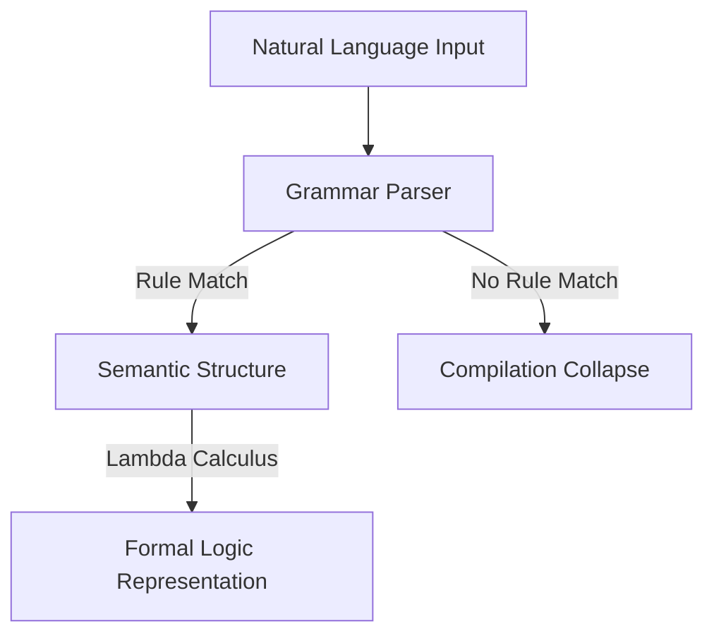

# The Rule-Based Syntactic Era

## Detailed Information
Early autoformalization systems relied heavily on manual parsing techniques, using structural and syntactic rules. Hand-crafted grammars (such as Definite Clause Grammars) mapped natural language constructs to logical predicates. These systems translated natural language inputs into representations like lambda calculus or direct theorem prover syntax. However, their rigidity meant they collapsed when faced with syntax variance, typos, or slang.

## Diagram

## Navigation
[← Back to Main README](../README.md)
