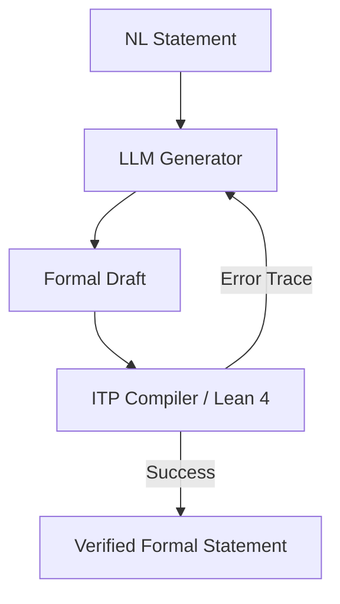

# The Self-Correcting & Reinforcement Learned Era

## Detailed Information
Modern autoformalization integrates language models into closed feedback loops with Interactive Theorem Provers (ITPs) like Lean 4. The model drafts code, the compiler type-checks it and returns error stack traces, and the LLM recursively corrects its code until the verifier passes it. This is reinforced via learning algorithms optimized for logical correctness.

## Diagram

## Navigation
[← Back to Main README](../README.md)
