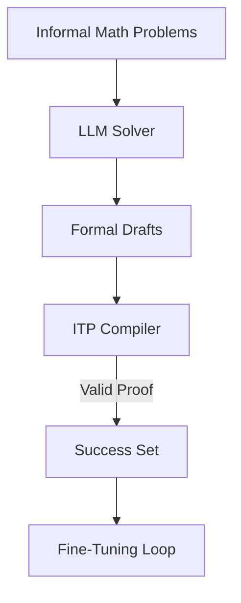

# STaR-Style Verification Loops

## Detailed Information
Based on the Self-Taught Reasoner (STaR) method, this loop continuously generates formalizations, runs them against theorem prover environments, and keeps the ones that verify. The model then fine-tunes on the successful generations to improve its reasoning capability.

## Diagram

## Navigation
[← Back to Main README](../README.md)
