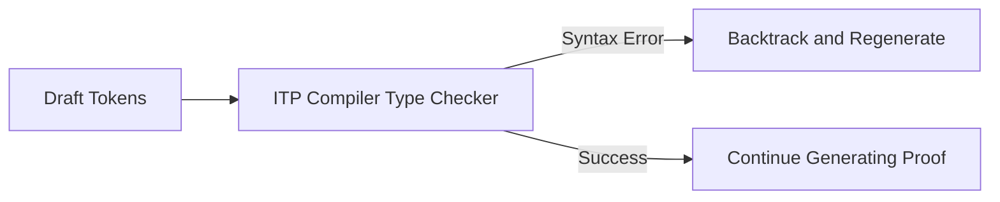

# The Syntactic Hallucination & Compilation Barrier

## Detailed Information
LLMs often output syntactically invalid code that looks correct but fails compilation due to type errors, wrong library references, or syntactic bugs. Mitigated by using Compiler-in-the-Loop decoding, where the parser checks intermediate states.

## Diagram

## Navigation
[← Back to Main README](../README.md)
