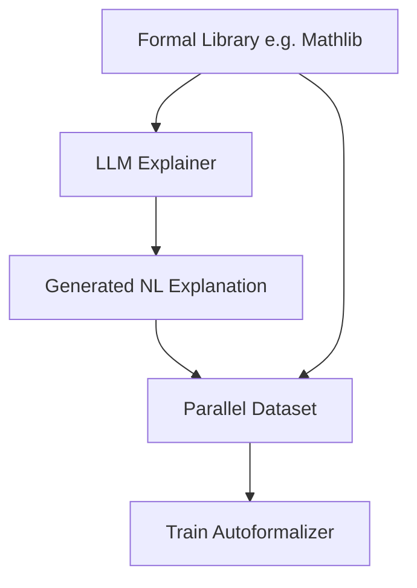

# Synthetic Informal-to-Formal Back-Translation

## Detailed Information
Overcomes data scarcity by taking vast, verified databases of formal math or code and translating them into natural language explanations. This creates a parallel corpus to train models for the reverse task: autoformalization.

## Diagram

## Navigation
[← Back to Main README](../README.md)
