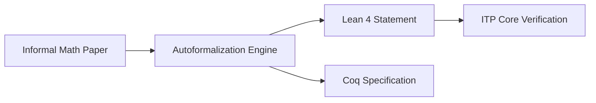

# Theorem Prover Autoformalization (Math Domain)

## Detailed Information
This variant translates informal natural language mathematics into specialized languages verified by Interactive Theorem Provers (ITPs). Systems target platforms like Lean, Isabelle, Coq, and Mizar, allowing AI to verify mathematical statements and discover new mathematical theories alongside human researchers.

## Diagram

## Navigation
[← Back to Main README](../README.md)
